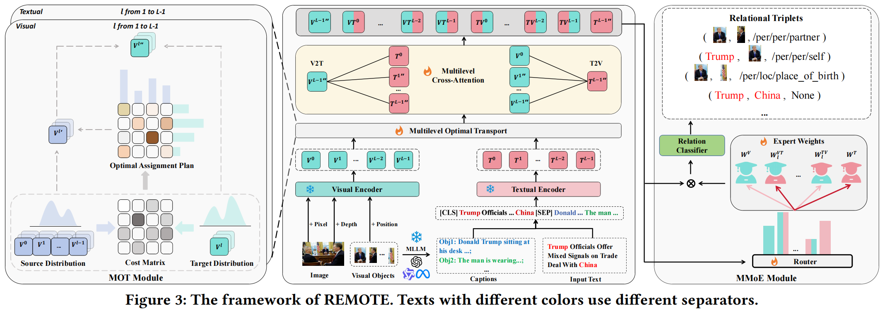
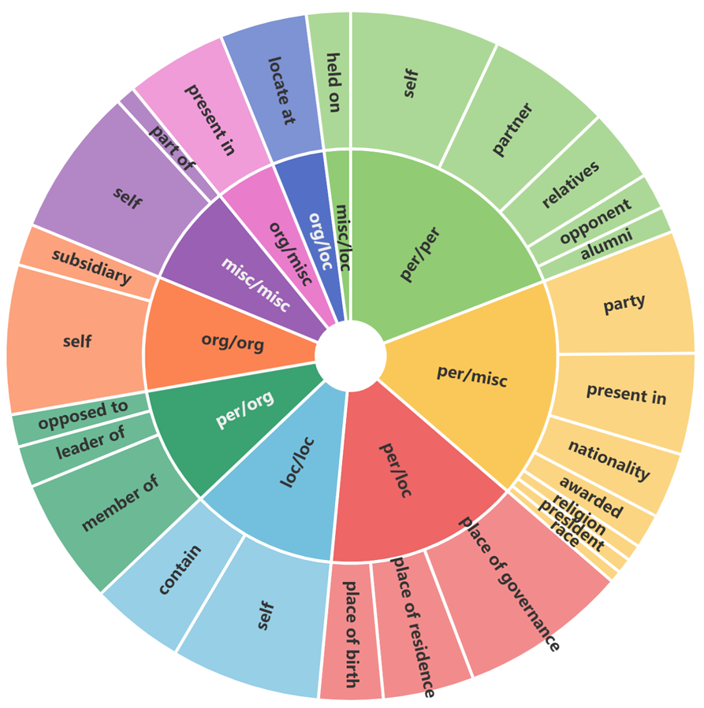

# REMOTE: A Unified Multimodal Relation Extraction Framework with Multilevel Optimal Transport and Mixture-of-Experts

The source code for **REMOTE: A Unified Multimodal Relation Extraction Framework with Multilevel Optimal Transport and Mixture-of-Experts**.

# News🔥

🎉🎉🎉 **[July. 2025]** We are delighted to announce that our paper, **"REMOTE: A Unified Multimodal Relation Extraction Framework with Multilevel Optimal Transport and Mixture-of-Experts"**, has been accepted by ACM MM 2025!

</h5>
<p align="center">
    
</p>

📆 **[July. 2025]** [UMRE dataset](https://drive.google.com/file/d/17N_GVv5sCnT55ZUi_5dXl66bac1TuUlC/view?usp=sharing) has been released.

# UMRE Dataset
</div>

<br>

<div align="center">

</div>

Our UMRE dataset is a further development of the [MNRE dataset](https://github.com/thecharm/MNRE) and [MORE dataset](https://github.com/NJUNLP/MORE).

---

## 📦 Installation Guide

### 1.  Download Required Datasets

#### UMRE Dataset
Download the [UMRE Dataset](https://drive.google.com/file/d/17N_GVv5sCnT55ZUi_5dXl66bac1TuUlC/view?usp=sharing) and extract it:
```bash
unzip UMRE_Data.zip -d datasets/
```

#### UMKE Partner Supplementary Files
Download the [UMKE Partner Supplementary Files](https://drive.google.com/file/d/1ozJ25WaSnHJ7De84tdAWncBU9YV57nYG/view?usp=sharing) and extract them:
```bash
unzip umke_partner.zip -d datasets/
```

### 2.  Generate Depth Maps

#### Step 1: Set up Depth Estimation Model
1.  Clone the official [Depth-Anything-V2 repository](https://github.com/DepthAnything/Depth-Anything-V2):
```bash
git clone https://github.com/DepthAnything/Depth-Anything-V2
cd Depth-Anything-V2
```
2.  Follow their installation instructions to set up dependencies.

#### Step 2: Process UMKE Images
Return to your ROMOTE project directory and generate depth maps:
```bash
python ROMOTE_code/depth_data/test.py 
```
This will generate corresponding depth maps for all images in the UMKE dataset.

---

### 3.  Execute Training/Inference

Run the main pipeline with optimized configurations:
```bash
bash ROMOTE_code/run_umke_best.sh
```

> **Tip**: Ensure all dependencies are installed and paths in `run_umke_best.sh` match your directory structure.

---

# Acknowledgement  
Our dataset is extended based on the methods from [RIVEG](https://github.com/JinYuanLi0012/RiVEG) and [PGIM](https://github.com/JinYuanLi0012/PGIM) on the [MNRE dataset](https://github.com/thecharm/MNRE) and [MORE dataset](https://github.com/NJUNLP/MORE), followed by manual annotation and correction of relational triplets.  

Our code is built upon the open-sourced [HVFormer](https://github.com/liuxiyang641/HVFormer) and [MOREformer](https://github.com/NJUNLP/MORE). Thanks for their great work!

